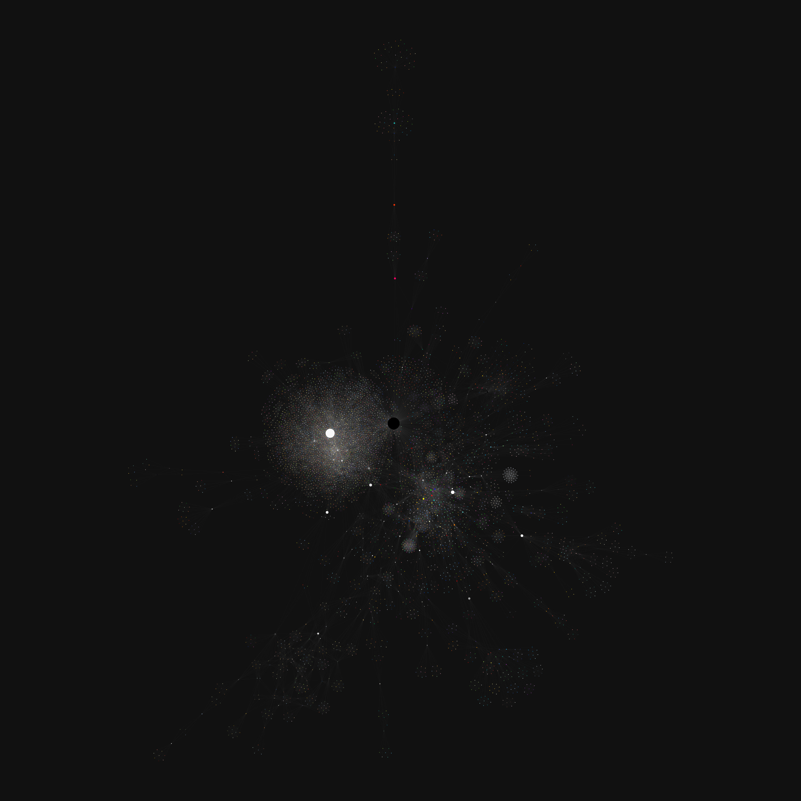

# Color co-occurrence network

Palettes connect colors. And different palettes can share colors. Therefore, colors that connect different palettes grow a network. What does that network look like?



To answer my curiosity, I built this. A network of colors built from the [pypalettes](https://github.com/JosephBARBIERDARNAL/pypalettes) dataset: two colors are linked when they appear together in the same palette. Each node is drawn in its own color and sized by its centrality.

Run:

```bash
python data.py && python network.py
```
